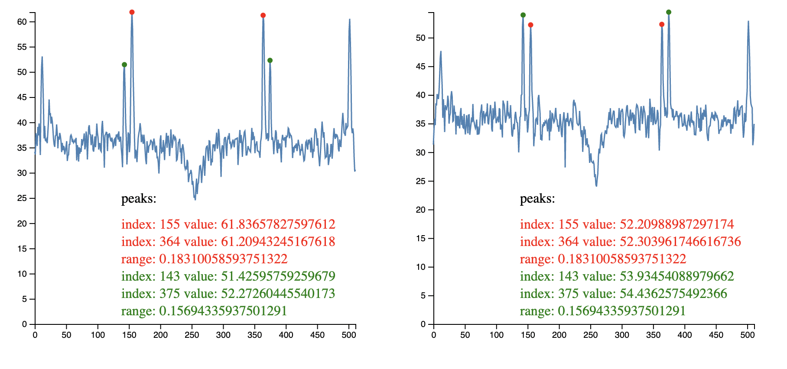

# peak-finding

Repo for testing peak finding algorithms for the range profile (`rp`) in mmWave demo visualizer. Open peak-finder-visualizer.html in a browser to view.

## Single tag detection

## Multi-tag detection

